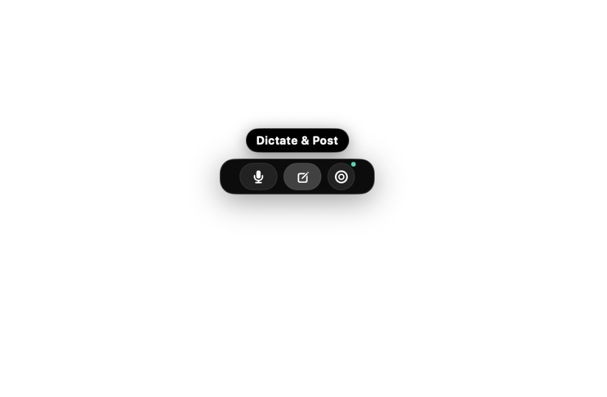
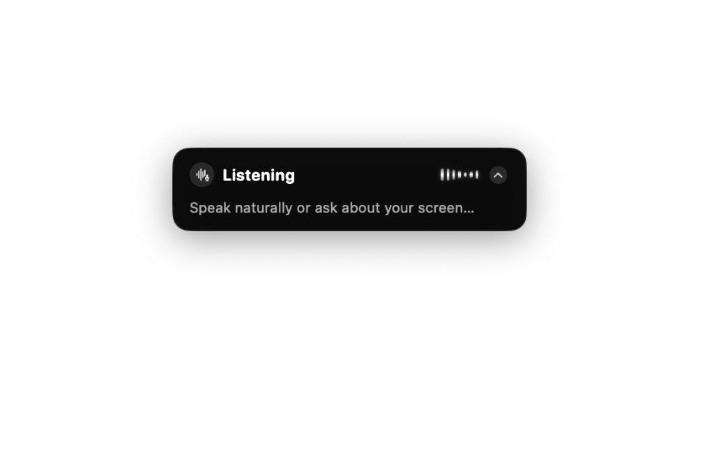
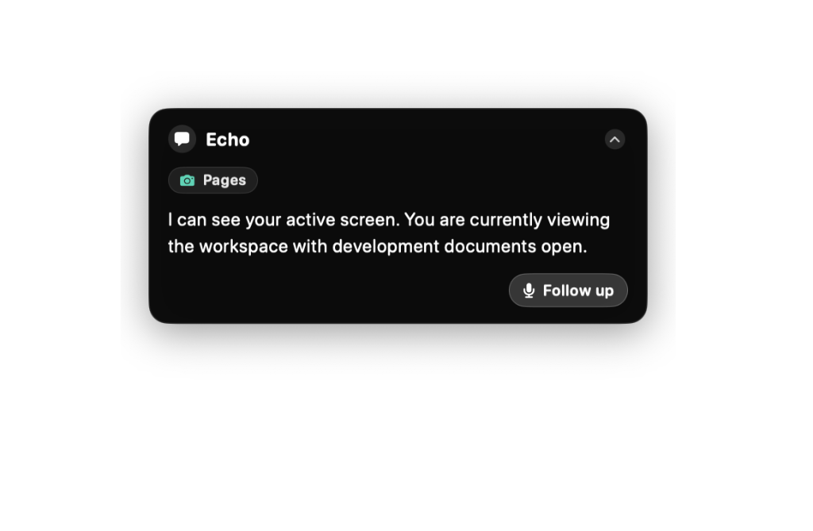
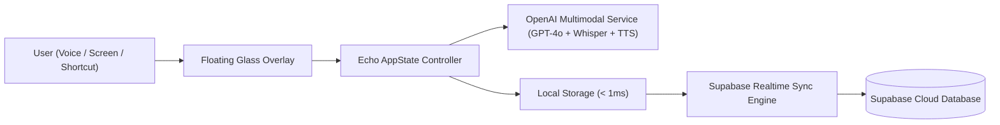

# <p align="center"><br><code>Echo</code> — Native macOS AI Voice + Vision Companion</p>

<p align="center">
  <strong>Instant, hands-free conversational AI, on-demand screen understanding, and local-first cloud synchronization.</strong>
</p>

<p align="center">
  
  
  
  
  
</p>

---

## ✨ Visual Showcase

<div align="center">
  <table>
    <tr>
      <td align="center" width="50%">
        
        <br/>
        <strong>1. Resting Obsidian Capsule</strong>
        <p>Minimalistic glass pill hovering seamlessly at the bottom of your workspace.</p>
      </td>
      <td align="center" width="50%">
        
        <br/>
        <strong>2. Hover Mode & Tooltips</strong>
        <p>Reveals Voice, Dictate & Post, and Screen Vision controls with tooltip bubbles.</p>
      </td>
    </tr>
    <tr>
      <td align="center" width="50%">
        
        <br/>
        <strong>3. Active Listening & Sinusoidal Wave</strong>
        <p>Continuous hands-free speech recognition with dynamic 60fps audio waveforms.</p>
      </td>
      <td align="center" width="50%">
        
        <br/>
        <strong>4. Contextual Screen Response</strong>
        <p>Instant GPT-4o vision analysis of active apps (Pages, VS Code, Safari, YouTube).</p>
      </td>
    </tr>
  </table>
</div>

---

## ⚡ Core Capabilities

### 🎙️ 1. Continuous Hands-Free Dialogue Loop
- **Global Summon Shortcut (`⌥ Option + Space`)**: Press once to begin natural back-and-forth multi-turn conversation.
- **Pure OpenAI Neural Voice**: Zero robotic delays — speaks with OpenAI neural voice synthesis (`tts-1` / `echo`, `alloy`, `nova`, `shimmer`).
- **Snappy Response Turnaround**: Fast silence detection (`1.1s`) and automated mic re-arming.

### 👁️ 2. On-Demand Screen Vision Intelligence
- **Shutter Snapshot OCR**: Analyzes whatever is on your display (code in VS Code, video on YouTube, PDF research).
- **Context-Aware Assistance**: Proposes immediate solutions, bug fixes, search queries, and URLs.
- **Active Cursor Auto-Paste**: Translates or polishes your thoughts and automatically pastes directly into your active window.

### ☁️ 3. Hybrid Local-First & Supabase Realtime Sync
- **Local Persistence (< 1ms)**: Saves every session, transcript, and note to encrypted local storage with zero network lag.
- **Supabase Cloud Sync**: Synchronizes all sessions, messages, and screenshots with your Supabase PostgreSQL cloud database in real-time.
- **Built-in Authentication**: Login & Registration with **Admin Mode** and secure macOS Keychain token storage.

### 📊 4. Intelligence History Dashboard
- **Smart Topic Auto-Titling**: Generates human-readable titles (e.g. *`Screen: Workspace Analysis`*, *`Note: Architecture Plan`*, *`YouTube Search: Swift Concurrency`*).
- **Extracted Resource Links**: Clickable resource cards for every link, documentation reference, and video suggested by the AI.
- **Speech Replay**: Re-listen to any historical AI response with a single click.

---

## ⌨️ Shortcuts & Controls

| Shortcut | Action | Description |
| :--- | :--- | :--- |
| **`⌥ Option + Space`** | **Summon Voice Assistant** | Launches the continuous hands-free dialogue loop |
| **`Hover Pill`** | **Reveal Actions** | Expands pill into Voice, Dictate, and Vision buttons |
| **`Esc`** | **Collapse HUD** | Minimizes active overlay back to the resting capsule |
| **`Click Profile`** | **Auth Modal** | Opens the Supabase Sign-in / Admin account dashboard |

---

## 🛠️ Tech Stack & Architecture

- **UI & Lifecycle**: SwiftUI, AppKit (`NSPanel`, `NSWindowLevel.floating`), Observation framework
- **Audio & Speech**: `AVAudioEngine`, `AVAudioPCMBuffer`, OpenAI Whisper API, OpenAI Neural Audio (`tts-1`)
- **Vision Pipeline**: CoreGraphics (`CGDisplayCreateImage`), ImageIO, OpenAI GPT-4o Multi-modal Vision API
- **Cloud & Auth**: Supabase Realtime, PostgreSQL, JWT Authentication
- **Security**: Apple Security framework (`macOS Keychain`)



---

## 🚀 Getting Started

### Prerequisites
- macOS 14.0 (Sonoma) or macOS 15.0+ (Sequoia)
- Xcode 15.0+ or Swift 5.10+ command line tools

### Build & Run

```bash
# Clone the repository
git clone https://github.com/wavesiddhartha/-echo.git
cd -echo

# Build the project
swift build

# Run automated tests
swift test

# Launch Echo
swift run Echo
```

---

## 🔑 Configuration & API Keys

1. Launch Echo and open **`⚙️ Settings`** $\rightarrow$ **`🔑 AI & Security`**.
2. Enter your **OpenAI API Key** (it will be encrypted in your **macOS Keychain**).
3. Under **`☁️ Cloud & Sync`**, connect your **Supabase Project URL** and **Publishable Key** to enable cloud synchronization.

---

## 📄 License

Distributed under the MIT License. See `LICENSE` for more information.

<p align="center">Made with ❤️ by <a href="https://github.com/wavesiddhartha">Siddhartha</a></p>
